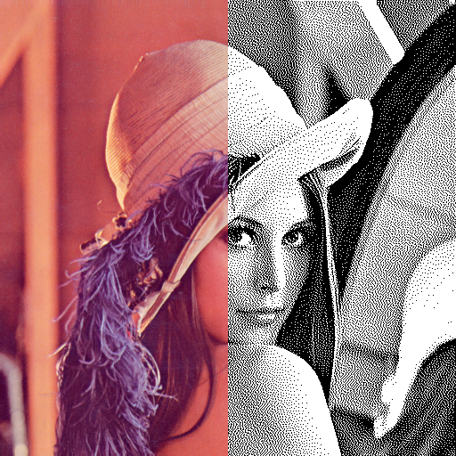
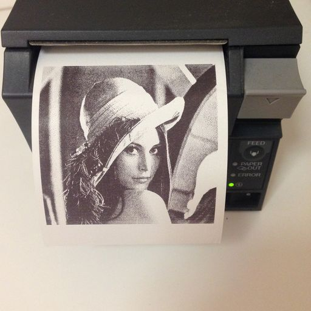

# png2pos

png2pos is a utility to convert PNG images to ESC/POS format (printer
control codes and escape sequences) used by POS thermal printers.
Output file can be just sent to printer.

**png2pos does not contain any Epson drivers, it is not a driver/filter
replacement… png2pos is just a utility for embedded projects, for whose
printing PNG files is sufficient and ideal lightweight solution.**

png2pos is:

* **free** and open-source
* rock **stable**
* highly **optimized**, fast, tiny and lightweight (few KiBs binary, no lib dependencies)
* **secure** (does not require any escalated privileges)
* using **high-quality** algorithms
* easy to use
* multiplatform (tested on Linux — x86 and ARM/Raspberry Pi, OS X and Windows)
* well **tested**
* 100% handcrafted in Prague, CZ :-)

## How does it work?

It accepts any PNG file (B/W, greyscale, RGB, RGBA), applies Histogram
Equalization Algorithm and via "Jarvis, Judice, and Ninke" Dithering 
Algorithm converts it to B/W bitmap wrapped by ESC/POS commands.

ESC/POS is a printer language. The “POS” stands for “Point of Sale”,
the “ESC” stands for “escape” because command instructions are escaped 
with a special characters. png2pos utilizes ```ESC@```,
```GSV```, ```GS8L``` and ```GS(L``` ESC/POS commands. It also prepends 
needed printer initialization binary sequences and adds paper cutoff 
command, if requested.

png2pos requires 5 × WIDTH (rounded up to multiple of 8) × HEIGHT
bytes of RAM. (e.g. to process full-width image of receipt 768 pixels
tall you need about 2 MiB of RAM.)

## Pricing and Support

png2pos is free MIT-licensed software provided as is. If you like
png2pos and use it, please let me know, it motivates me in further
development.

**Unfortunately I am unable to provide you with free support. Please,
do not ever ask me to assist you with source code modifications or to 
make a special build for you etc., if you use png2pos for your business
(especially if you have not donated to its development). It is your
job you are paid for.**

Important: png2pos will *never ever* be like Emacs; it is simple 
and specialized utility.

There is also an alternative project called
[png2escpos](https://github.com/twg/png2escpos) created
by The Working Group Inc. It's younger, simpler and uses libpng.
png2pos is in all aspects mature, nevertheless you may like alternative 
even more.

## Build

You have to build binary file yourself. Clone the source code:

    git clone --recursive https://github.com/petrkutalek/png2pos.git
    cd png2pos

To build and install binary just type:

    make
    sudo make install

On Mac typically you can use clang preprocessor:

    make CC=clang
    sudo make install

On Linux you can also build static binary (e.g. also based on
[musl](http://www.musl-libc.org/intro.html)):

    make CC=/usr/local/musl/bin/musl-gcc static
    sudo make install

png2pos has no lib dependencies and is easy to build and run on Linux,
Mac and Windows.

### seccomp

png2pos usually writes its output directly to device (i.e. /dev/ file).
To override default file permissions people often mistakenly escalate
priviledges of png2pos by `sudo` command. To protect against possible
software bugs, since version 1.7.1 png2pos implements support for Linux
seccomp BPF filters. 

png2pos restricts itself in using syscalls. There are hundreds of syscalls
available (to adjust system time, to connect to socket via network, 
to change priviledges, to reboot system etc.) png2pos requires only twelve
different system calls (mainly for memory allocations and operations with files).
If we disable all system calls we do not use, png2pos could not be abused
if any bug is found in the future.

## Usage examples

    png2pos -c -p -o /dev/usb/lp0 /tmp/image.png

or

    png2pos -c -p /tmp/image.png > /dev/usb/lp0

Please see man page:

    man png2pos

## Example

### Lena

Below you can see original image and produced output bitmap:

* Original (24 bits per pixel)
* Produced B/W dithered version ("Jarvis, Judice, and Ninke"
Dithering algorithm, 1 bit per pixel)



Final copy


